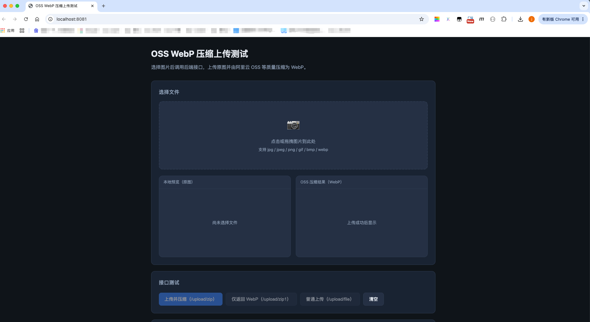
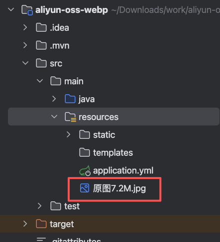
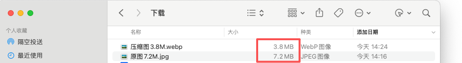

# 开始

### 阿里云oss图片上传
对图片进行压缩，上传到阿里云oss

### 配置修改

* 配置文件 application.yml 修改aliyun参数配置
* 质量分数自行调整，现在设置的是90分
* 去aliyun控制台搜索oss，进入产品里面新建一个bucket，例如：oss-prod
* 创建三个目录：dir(普通目录)、original_image(原图)、thumbnail_image(压缩图)

### 测试

* 1、启动项目，访问：http://localhost:8081 进行文件上传

* 2、上传图片，测试图已放在resources目录下，自行下载

* 2、swagger接口地址：http://localhost:8081/swagger-ui.html

### 结果
原图7.2M,压缩后3.8M
